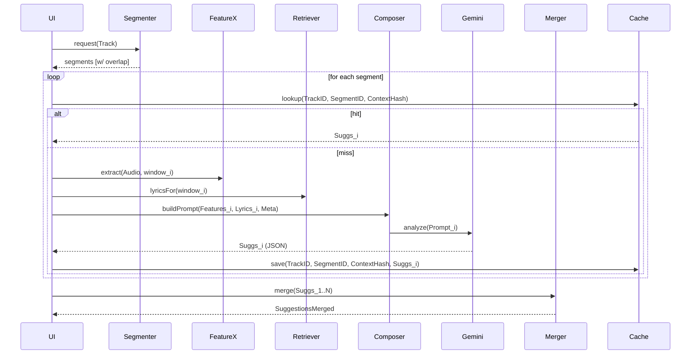

# Projekt-Roadmap

Diese Roadmap hält den Entwicklungsstand, die nächsten Schritte und mittel- bis langfristige Erweiterungen fest. Sie ergänzt README/SPEC/docs und dient als lebendes Dokument für Planung und Nachvollziehbarkeit.

## 0) Aktueller Stand & Erkenntnisse

- Architektur: React + TS + Vite; Tailwind + shadcn/ui; Web Audio API; TF.js + Gemini; Genius-Integration (Lyrics, Referents)
- Zwei-Ebenen-KI: Basis (Gemini) + personalisierte Korrektur (TF.js) pro Profil
- Persistenz: localStorage (AppState, Trainingsdaten, Modelle)
- UI-Migration: shadcn/ui teilweise; Responsive Überarbeitung begonnen
- **KI-Qualität**: Aktuell ~3/10 Gemini-Vorschläge brauchbar/an richtiger Stelle → Verbesserungsbedarf hoch
- **Genius-Kontext**: Lyrics + Referents werden übergeben, aber unklar ob das hilft oder Kontext aufbläht

## 1) Nächste Phasen (Neu priorisiert)

1. **Responsive Design vervollständigen** (wie geplant)
   - Tooltip-Clamping in Timeline; Header XS/SM Kompaktierung; Timeline-Höhen/Hitboxen; Touch-Tests
2. **KI-Qualität: Gemini-Vorhersagen verbessern** (neue Priorität)
   - Audio-Features erweitern (Harmonic/Percussive, Chroma); Prompt-Engineering; Kontext-Optimierung; Segmentierung evaluieren
3. **Personalisierung erweitern** (nach KI-Basis-Verbesserung)
   - Negative Samples; mehr Dimensionen (Intensity/Confidence/GEMS); Training-Strategien
4. **LabelPanel – UI-Konsistenz**
   - Slider → shadcn/ui; numerische Readouts; Mobile Modal-Usability; GEMS/Trigger-Checks
5. **Button-Variants & Theme**
   - cva-Variants; prominente Actions hervorheben; Token-Doku
6. **Accessibility-Review**
   - ARIA/Labels; Modal-Fokus; Tastatur-Navigation (Basis); Kontraste
7. **Netzwerkstabilität/Proxy-Strategie**
   - Konfigurierbare CORS-Proxy-URL; Dev-Proxy; Gemini-Proxy Design (Key/Quotas)
8. **QA & Dokumentation**
   - Manuelle Checkliste; README-Update; optional Test-Setup-Plan

## 1.1) Erkenntnisse zu KI-Qualität & Personalisierung

### Audio-Features: Warum Harmonic/Percussive + Chroma wichtig sind

- **Harmonic/Percussive Separation**: Trennt melodische von rhythmischen Elementen → bessere Erkennung von emotionalen Höhepunkten (Melodie-Drops vs. Beat-Drops)
- **Chroma Features**: Tonart-/Akkord-Erkennung → Dur/Moll-Wechsel sind starke emotionale Indikatoren
- **Onset Detection**: Strukturelle Momente (neue Instrumente, Breaks) → natürliche Marker-Kandidaten

### Personalisierung: Erweiterte Strategien

- **Negative Samples**: Abgelehnte KI-Vorschläge sammeln → "Was der User NICHT will" lernen
- **Mehr Dimensionen**: Nicht nur Valence/Arousal, auch Intensity/Confidence/GEMS personalisieren
- **Minimum Samples**: 10 Samples evtl. zu wenig → experimentell 20-30 testen
- **Datenqualität**: User-Korrekturen vs. komplett neue Marker unterschiedlich gewichten

### Genius-Kontext: Optimierungspotenzial

- **Problem**: Referents können Kontext aufblähen ohne Mehrwert
- **Lösung**: Nur Lyrics-Zeilen ± 10s um potenzielle Marker-Zeiten senden
- **Evaluation**: A/B-Test mit/ohne Referents bei gleichen Songs

## 2) Mittel-/Langfristige Erweiterungen

### 2.1 KI: Initialvorhersage (Gemini) näher an menschlicher Wahrnehmung

Ziel: Weniger Nacharbeit für Nutzer, höhere Präzision der vorgeschlagenen Marker.

- Prompt-Engineering
  - Strukturierte Anleitung (rollenbasiert), explizite Bewertungsdimensionen (Valence/Arousal/Intensity/Confidence/GEMS/Trigger), Beispiele (few-shot) aus Kurationsset.
  - Kontextebenen getrennt übergeben (Metadaten, Lyrics, Referents, Audiofeatures) mit klaren Instruktionen pro Abschnitt.
  - Konsistentes Response-Schema (JSON Schema + strikte Validierung) mit Fehlertoleranz (Korrekturpfad bei Schemafehlern).
- Audiofeature-Engineering (siehe 2.3)
  - Besser aufbereitete Features (z. B. Smoothed/Normalized, Event-Detections) als „Hinweise“ für die KI.
- Retrieval-Augmented Context (RAC)
  - Nur relevante Lyric-Segmente und Referents zu den potentiellen Hotspots feingranular nachladen (statt kompletter Lyrics), um Tokenbudget zu sparen und Relevanz zu erhöhen.
- Adaptive Prompting
  - Temperature/TopP dynamisch gemäß Track-Charakteristik; bei „unsicherer“ Vorhersage mehr Erklärungen und niedrigere Confidence; bei klaren Mustern reduzierter Fluff.
- Feedback-Loop nutzen
  - Aus bestätigten/abgelehnten Vorschlägen (User-Edits) „few-shot Beispielfälle“ generieren (anonymisiert) und in einen rotierenden Beispielpool aufnehmen (lokal pro Profil oder global kuratiert).

### 2.2 Visualisierung: Musik besser „lesbar“ machen

- Mehrspurige Timeline
  - Eigenständige Spuren für: Amplitude, Spectral Centroid, Onset-Events, Harmonic Change (Tonartwechsel/Chord-Änderung, heuristisch), KI-Hotspots, Marker.
- Alternativer Modus: Mini-Spektrogramm
  - 2D-Heatmap (Low-Res) für grobe Struktur (Bass/Drums/Vocals-Anteile heuristisch/energetisch), performance-schonend.
- Struktur-Overlays
  - Segmentierung (Intro/Verse/Chorus/Bridge/Outro) heuristisch oder KI-gestützt anzeigen; vertikale Marker bzw. farbliche Bänder.
- Zoom-Presets und Navigationshilfen
  - „Jump to next onset/section/marker“ Buttons, Tastaturkürzel, Mini-Map.

### 2.3 Zusätzliche Audio-Analysen (lokal, performant)

- Onset/Beat-Detection (einfach)
  - Einfache Onset-Erkennung (Hüllkurve + Schwellen), Beat-Approximation; Marker-Hilfslinien.
- Spectral Flux & Roll-Off
  - Bereits teilweise vorhanden (Flux/Centroid); Roll-Off als weiteres Timbre-Merkmal; smoothe und normiere Features.
- Chord/Harmonic Change (heuristisch)
  - Rolling chroma-like Approximation aus FFT-Bändern; Change Detection für Strukturhinweise.
- Silence/Low-Activity
  - Längere Ruhephasen als potentielle „emotionale Kontraste“ markieren.
- Export dieser Features für Gemini
  - Als kompaktes JSON (Downsample/Quantize), z. B. 10 Hz, mit statistischen Zusammenfassungen pro Segment.

### 2.4 Gemini-Limits: Tokenbudget, Kosten, Latenz

- Problem: Je mehr Kontext (Lyrics + Referents + reichhaltige Audiofeatures), desto höher Tokenverbrauch.
- Evaluierung/Schätzung (modell-/versionabhängig, Beispiele):
  - Prompt + Systeminstruktion: ~1–2k Tokens
  - Lyrics (komplett): 1–5k Tokens (stark variabel)
  - Referents (zeilenweise Annotationen): 0.5–3k Tokens
  - Audiofeatures (kompakt): 0.5–1.5k Tokens
  - Summe kann 4–10k Tokens erreichen — abhängig vom Modell/Limit.
- Risiken
  - Überschreitung des Kontextfensters → Fehler/Abbruch; hohe Latenz/Kosten.
- Gegenmaßnahmen
  - Kontext-Selektion: Relevante Lyric-Ausschnitte rund um Kandidatenzeiten (RAC), nicht Volltext.
  - Zusammenfassungskaskaden: Zuerst abschnittsweise Features/Lyrics verdichten; dann aggregierte Zusammenfassung statt Rohdaten senden.
  - Segmentiertes Processing: Track in Abschnitte teilen (z. B. 30–60 s Fenster mit Überlappung) und Vorhersagen pro Abschnitt erstellen; danach mergen/entduplizieren.
  - Strenges Schema + Validierungs-/Repair-Schritt: Bei Invalid JSON → Re-Prompt mit kompakterem Kontext.
  - Caching & Idempotenz: Für denselben Track + Kontext nicht erneut komplette Analysen ausführen.

### 2.5 Prompt-/Datenübergabe-Optimierung

- Datenschema
  - Feste, klar beschriftete Abschnitte: SYSTEM, AUDIO_FEATURES (kompakt), SONG_METADATA, LYRICS_SNIPPETS (+referents), TASK, RESPONSE_SCHEMA.
- Fensterung & Relevanzfilter
  - Zuerst grobe Hotspots mit leichten Features; dann nur lokal relevante Lyrics/Referents in zweitem Schritt anreichern.
- Quantisierung & Normalisierung
  - Audiofeatures auf feste Skalen bringen (0–1, Z‑Score o. ä.), Reduktion auf wenige statistische Kennzahlen pro Fenster.
- Beispiel‑Guides
  - 2–3 kuratierte Beispiele als „goldene Markierungen“ (anonymisiert) im Prompt mitgeben.

## 3) Risiken & Gegenmaßnahmen (Auszug)

- Externe Abhängigkeiten (CORS-Proxy/Genie/Gemini)
  - Konfigurierbare Proxy-URL; Dev-Proxy; optional eigener Gemini-Proxy.
- Token/Latenz-Kostenanstieg
  - Segmentierung, RAC, Caching, Reduktion und Zusammenfassung.
- UI‑Komplexität
  - Iterative Migration (shadcn/ui), konsistente Variants/Tokens, QA-Checkliste.

## 4) Messgrößen (Messbar machen)

- UX: Zeit bis zur ersten sinnvollen Marker‑Korrektur (Median) je Track
- KI: Anteil übernommener Marker ohne Änderung; MAPE der Valence/Arousal ggü. Benutzerlabels
- Performance: Analyse‑Latenz; Tokenverbrauch pro Analyse
- Stabilität: Fehlerquoten bei API‑Calls; Abbrüche durch Kontextüberschreitung

## 5) Offene Fragen / Entscheidungen

- Gemini-Proxy: ab wann lohnt sich Betrieb (Kosten/Nutzen)?
- Struktursegmentierung: heuristisch vs. KI‑gestützt (externer Dienst vs. lokal)?
- Globaler Few‑Shot‑Pool: Wie kuratieren/privatsphäreschonend aggregieren?

---

## 6) Architektur‑Sketch: Segmentiertes Processing + RAC

Ziel: Tokenbudget, Kosten und Latenz kontrollieren, indem lange Tracks in überlappende Segmente (z. B. 30–60 s) zerlegt werden und nur relevante Lyrics/Referents kontextualisiert werden (Retrieval‑Augmented Context, RAC).

Bausteine:

- Segmenter: Zerlegt den Track in Fenster mit Überlappung (z. B. 45 s + 5 s overlap).
- Feature Extractor: Erstellt kompakte Feature‑Vektoren je Segment (Amplitude/Centroid/Flux/Roll‑Off/Onsets/…; quantisiert).
- Lyrics Retriever: Liefert nur die textuellen Ausschnitte (Lyrics + Referents), die mit dem Segment-Zeitfenster überlappen.
- Prompt Composer: Baut ein schlankes, strikt strukturiertes Prompt mit Schema.
- Gemini Client: Führt pro Segment die Analyse aus (ggf. mit Retry/Repair‑Pfad bei Schemafehlern).
- Merger: Vereinigt Segment‑Vorschläge, dedupliziert nahe Marker und glättet Werte (Valence/Arousal/Intensity), löst Konflikte.
- Cache: Speichert Ergebnisse pro (TrackID, SegmentID, ContextHash) zur Wiederverwendung.

Pseudo‑Flow (vereinfacht):

1. Input (Track, optional SongContext)
2. Segmentierung in N Fenster mit Überlappung
3. Für jedes Segment i:
   - Features_i = ExtractFeatures(Audio, window_i)
   - Lyrics_i = RetrieveLyrics(SongContext, window_i)
   - Prompt_i = ComposePrompt(Features_i, Lyrics_i, Meta, Schema)
   - Suggs_i = Gemini(Prompt_i)
4. Merge(Suggs_1..N) → normalize, dedupe, smooth
5. Optional: Post‑Refinement durch persönliches TF.js‑Modell
6. Persist/Cache Ergebnisse

Kompaktes Sequenzdiagramm (Mermaid):

Hinweise/Trade‑offs:

- Overlap nötig, um Marker an Segmentgrenzen korrekt zu erkennen (später beim Merge entduplizieren).
- Lyrics Retrieval sollte tolerant sein (± ein paar Sekunden) und Referents/Annotations mitliefern.
- Prompt_i strikt klein halten: Features quantisieren (z. B. 10 Hz), Lyrics_i auf relevante Zeilen begrenzen, Metadaten minimal.
- Mögliche Erweiterung: 2‑stufiger Prozess (Stage1 Hotspots grob, Stage2 Feintuning nur an Hotspots mit erweitertem Kontext).

Stand: wird fortlaufend aktualisiert. Änderungen an Plan und Prioritäten bitte hier ergänzen.
